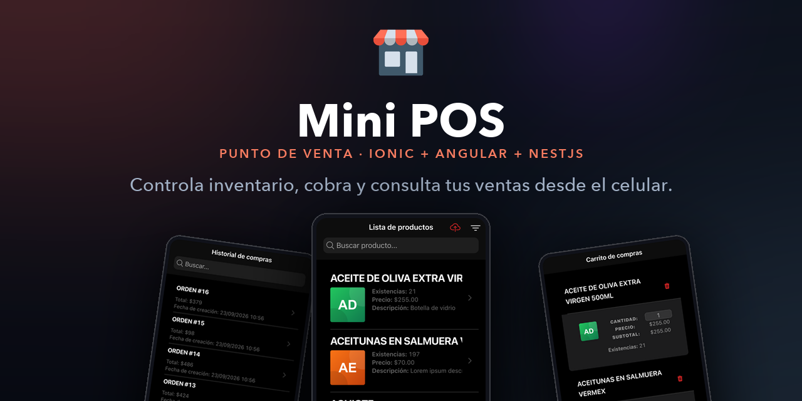
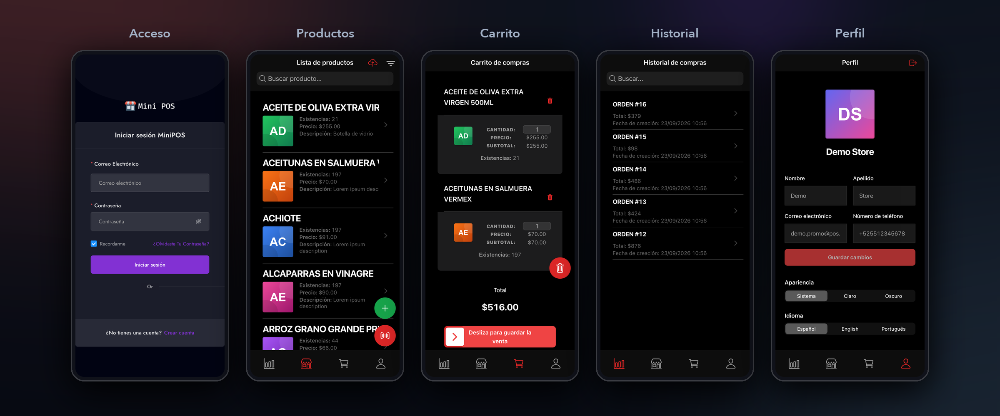

<p align="center">
  
</p>

## Description

ionic store - point of sales

## Screenshots

<p align="center">
  
</p>

El material para la ficha de Play Store y el resto de las piezas están en
[`promo/`](promo/README.md).

## Installation

```bash
npm install
```

## Running the app with ionci

```bash
ionic serve
```
